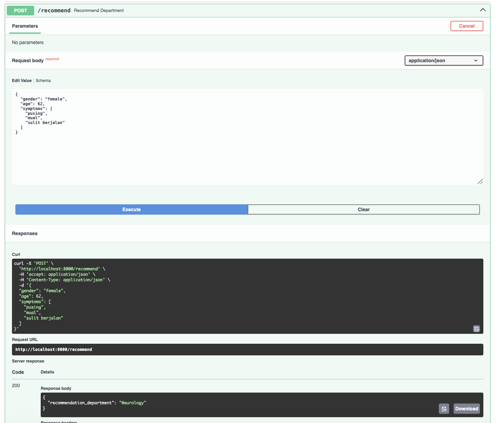

# BitHealth AI Engineer Test
This repository contains three practical cases designed to evaluate AI Engineering skills, including filter patients from CSV file, SQL query visit insight, and building an AI triage recommender agent.
Each case is independent but organized under a single project structure:

## Project Structure
```
BitHealth_AI_Test
├── README.md
├── case_1
│   ├── README.md
│   ├── assets
│   │   └── filter_patients.png
│   ├── data
│   │   └── patients.csv
│   └── filter_patients.ipynb
├── case_2
│   ├── README.md
│   ├── data
│   │   ├── hospital_records.db
│   │   ├── patients.csv
│   │   ├── symptoms.csv
│   │   └── visits.csv
│   ├── perform_query.ipynb
│   ├── query.sql
│   └── setup_db.ipynb
└── case_3
    ├── README.md
    ├── assets
    │   └── app.png
    ├── config.py
    ├── requirements.txt
    └── src
        ├── __init__.py
        ├── agent.py
        └── schema.py
```
## 🩺 Case 1 – Patient Filter (CSV)
### Overview:
Performs patient data filtering using a CSV dataset and returns the filtered results based on specified criteria.

### Dependencies:
```bash
pip install pandas
```

### How to Run:
1. Open the notebook file [filter_patients.ipynb](case_1/filter_patients.ipynb).
2. Run all cells sequentially.
3. Detailed explanation is provided in [README.md](case_1/README.md).

### Output:
The final output with tokenized `symptoms` column, and filtered patient data.


## 🧾 Case 2 - SQL for Patient Visit Insight
### Overview:
Executes an SQL query to analyze patient visit data and find the five most recent visits to the Neurology department where:
- The patient has at least 3 recorded symptoms, and
- The patient is older than 50 years.

### Dependencies:
```bash
pip install pandas
```

### How to Run:
1. Open the notebook file [setup_db.ipynb](case_2/setup_db.ipynb).
2. Run all cells in order.
3. Detail process to creating db and perform query are available in [README.md](case_2/README.md).

### SQL Query
```SQL
SELECT
    patients.name,
    patients.age,
    visits.visit_date,
    COUNT(symptoms.id) as symptom_count
FROM patients
JOIN visits ON patients.id = visits.patient_id
JOIN symptoms ON visits.id = symptoms.visit_id
WHERE visits.department = "Neurology" AND patients.age > 50
GROUP BY patients.name, patients.age, visits.visit_date
HAVING COUNT(symptoms.id) >= 3
ORDER BY visits.visit_date DESC
LIMIT 5;
```

## 🤖 Case 3 – AI Agent: Triage Recommender
### Overview:
Develops an AI Agent powered by LLM that provides triage recommendations based on patient conditions and symptoms.
The project uses LangChain, FastAPI, and exposes an API through Swagger UI for testing.

### Dependencies:
```bash
pip install -r requirements.txt
```

### Environment Setup:
Create a .env file under the root of case_3/ and include:
```.env
GOOGLE_API_KEY=your_api_key_here
MODEL_NAME=desire_model
```

### Run the Application:
Detail process to setup and run the agent are available in [README.md](case_3/README.md).
```bash
uvicorn app:app --host {host} --port {port}
```
Access the API Docs:
http://{host}:{port}/docs

Example Request (cURL):
```bash
curl -X POST "http://localhost:8000/recommend" \
  -H "Content-Type: application/json" \
  -d '{
        "gender": "female",
        "age": 62,
        "symptoms": ["pusing", "mual", "sulit berjalan"]
      }'
```
Expected response:
```json
{
  "recommended_department": "Neurology"
}
```
