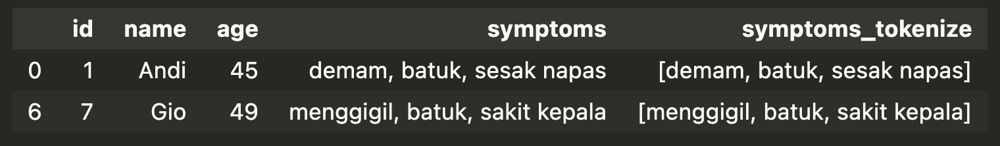

# Filter Patients

This Jupyter Notebook is designed to process patient data, tokenize symptom information, and filter records based on specific criteria.

## Goals

1. **Load CSV**  
   Read patient data from a `.csv` file.

2. **Tokenize Symptoms**  
   Split or tokenize the `symptoms` column into list object.

3. **Filter Data**  
   Apply filtering rules for patients older than 40 with more than 2 symptoms

---

## Installation

Make sure you have Python installed, then install the required dependency:

```bash
pip install pandas
```

## How to run
1. Save your dataset file (eg. `patients.csv`) in `data/`.
2. Open the notebook `filter_patients.csv`.
3. Adjust the data path in `fpath` variable.
4. Run all cells in order.
5. Notebook will display the loaded data, the tokenized `symptoms` column, and filtered patient data.

## Output
The final output with tokenized `symptoms` column, and filtered patient data.
